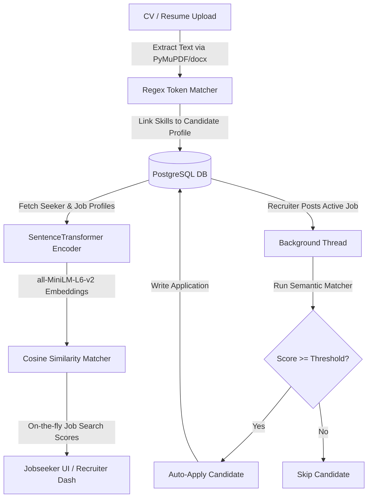

# 🧠 Machine Learning & AI Process Engine

This document details the Artificial Intelligence and Machine Learning processes powering the **Intelligent Job Portal**. The portal uses Natural Language Processing (NLP) models, keyword extraction networks, and background worker threads to automate job seeker applications and calculate precise match scores.

---

## 📋 Table of Contents
1. [Architectural Overview](#architectural-overview)
2. [Semantic Match Scoring Engine (`matcher.py`)](#semantic-match-scoring-engine-matcherpy)
3. [Resume Parsing & Skill Extraction Pipeline (`file_routes.py`)](#resume-parsing--skill-extraction-pipeline-fileroutespy)
4. [Background Auto-Apply Automation Workflow](#background-auto-apply-automation-workflow)
5. [Reliability & Graceful Fallback Mechanics](#reliability--graceful-fallback-mechanics)
6. [Required Dependencies & Installation](#required-dependencies--installation)

---

## 🏛️ Architectural Overview

The AI subsystem consists of three core components running asynchronously or on-demand:



---

## 🔍 Semantic Match Scoring Engine (`matcher.py`)

Rather than relying purely on exact keyword searches, the portal calculates matches semantically using pre-trained dense vector models.

### 1. Vector Profile Generation (Feature Engineering)
Before encoding, candidate profiles and job descriptions are structured into text representations:

* **Job Seeker Text Representation:**
  ```text
  Title: {Jobseeker Title} Skills: {Skill1, Skill2, ...} Education: {Education Details} Experience: {Role1: Desc1; Role2: Desc2; ...}
  ```
* **Job Opportunity Text Representation:**
  ```text
  Job Title: {Job Title} in {Department} ({Location}) Required Skills: {Skill1, Skill2, ...} Description: {Description}
  ```

### 2. Dense Vector Embedding
The engine lazy-loads the **Sentence-Transformers** model `all-MiniLM-L6-v2` from Hugging Face.
* Maps sentences and paragraphs into a **384-dimensional dense vector space**.
* Captures context, synonyms, and intent (e.g., matching a candidate with "Frontend Developer" experience to a job post requesting "React Engineer").

### 3. Similarity Scoring
The cosine similarity between the candidate vector ($u$) and job vector ($v$) is calculated:

$$\text{Similarity}(u, v) = \frac{u \cdot v}{\|u\| \|v\|}$$

The score is scaled to a percentage between `0%` and `100%`:
```python
match_score = min(100, max(0, round(similarity * 100)))
```

---

## 📥 Resume Parsing & Skill Extraction Pipeline (`file_routes.py`)

When job seekers upload their resume, the platform automatically parses and registers their skills:

```
[Resume Upload (PDF/DOCX)] ➔ [Text Extraction Engine] ➔ [Regex Skills Matcher] ➔ [Database Sync]
```

1. **Document Text Extraction:**
   * **PDF:** Uses `PyMuPDF` (`fitz`) to extract text layout.
   * **DOCX / DOC:** Uses `python-docx` (`DocxDocument`) to compile paragraph texts.
2. **Token-Aware Keyword Matching:**
   * Uses a curated dictionary of **200+ skills** spanning development, cloud, AI, design, cybersecurity, and soft skills.
   * Leverages lookaround regular expressions to ensure exact boundary matching:
     ```python
     pattern = r'(?<![\w/])' + re.escape(skill.lower()) + r'(?![\w/])'
     ```
     * Prevents false-positives (e.g., matching the programming language `"Go"` inside words like `"Google"`, `"going"`, or `"Django"`).
3. **Database Sync:**
   * Discovered skills are checked against the `skills` master table.
   * New skills are automatically registered, and relationships are stored in the `jobseeker_skills` table.

---

## ⚡ Background Auto-Apply Automation Workflow

To reduce frictional unemployment, the portal supports **Auto-Apply Automation**:

1. **Configuration:** Job seekers can toggle **Auto-Apply** on their profile and set their custom **Minimum Match Score Threshold** (default: `70%`).
2. **Two-Way Action Triggers:**
   * **Recruiter Action (Job-Centric):** When a recruiter posts a new job or activates a draft job (status = `'Active'`), the portal spawns a thread to evaluate all candidates for that single job:
     ```python
     import threading
     from matcher import run_auto_apply
     threading.Thread(target=run_auto_apply, args=(job_id,)).start()
     ```
   * **Jobseeker Action (Seeker-Centric):** When a job seeker enables auto-apply, updates their profile details/skills, or uploads a CV, the portal spawns a thread to evaluate all active jobs for that candidate:
     ```python
     import threading
     from matcher import run_auto_apply_for_candidate
     threading.Thread(target=run_auto_apply_for_candidate, args=(seeker_id,)).start()
     ```
3. **Evaluation & Filtering:**
   * Automatically screens target jobs and candidates to ensure only unapplied jobs are evaluated (preventing duplicate applications).
   * Computes semantic similarity scores asynchronously.
4. **Execution:** If the computed match score meets or exceeds the customized threshold, the background worker inserts a new application record in the database with status `'Applied'` and method `'Auto-Applied'`.

---

## 🛡️ Reliability & Graceful Fallback Mechanics

To prevent system crashes when external libraries, GPU/CPU drivers, or Sentence Transformers fail to initialize, the application features an integrated fallback layer:

* **Keyword Fallback Matching:**
  If the model fails to load, `matcher.py` automatically falls back to a keyword-overlap metric:
  
  $$\text{Fallback Score} = \frac{|\text{Job Seeker Skills} \cap \text{Job Skills}|}{|\text{Job Skills}|} \times 100$$
  
  * Returns `75%` if the job has no listed skills.
* **Database & Thread Isolation:**
  Auto-apply failures inside background threads are captured and rolled back safely without disrupting recruiter response times or HTTP connections.

---

## 📦 Required Dependencies & Installation

To run the machine learning capabilities, install the following dependencies in the Flask server directory:

```bash
# Navigate to the backend
cd flask_server

# Install ML, Parsing, and Database adapter packages
pip install sentence-transformers torch numpy pymupdf python-docx
```

* **Note:** On first startup, the server automatically downloads `all-MiniLM-L6-v2` (~90MB) and stores it in the local cache folder.

---

## 🧪 Verification Guide

To test and observe the ML/AI processes in action:

1. **Test Accounts:**
   * **Jobseeker:** `nlp_seeker@example.com` (password: `password123`)
   * **Recruiter:** `jane.doe@intelligentportal.com` (password: `password123`)
2. **Testing Semantic Match:**
   * Log in as the Jobseeker, and browse the job list. Notice the dynamic percentage matches next to each job.
3. **Testing CV Parsing:**
   * Log in as the Jobseeker, upload a PDF/DOCX resume containing words like "Python, React, AWS". Verify that the profile page updates to include these skills automatically.
4. **Testing Auto-Apply:**
   * Log in as the Jobseeker, toggle **Auto-Apply** ON, and set the threshold to `70%`.
   * Log in as the Recruiter, and publish a new job posting with "Python development" requirements.
   * Check the Recruiter's applicant list. The Jobseeker will be automatically applied with the status `Auto-Applied`.
